# Martin Spier 👋

VP of Engineering focused on **Platform Engineering**, **Cloud Infrastructure**, **Developer Experience**, **Performance** and **Reliability**.

I build and scale organizations and platforms that reduce cognitive load, improve deployment velocity, and make systems observable and cost-efficient — from developer workflows to production runtime.

- 💼 VP of Engineering @ Parasail (AI inference)
- 🧠 Interests: AI, platform engineering, performance engineering, distributed systems, observability, DX
- 📫 Contact: hello@martinspier.io
- 🔗 LinkedIn: https://linkedin.com/in/martinspier
- 📄 Resume: https://github.com/spiermar/resume.md
- 🌐 Site: https://martinspier.io

## Badges

## Now

- Building **AI & cloud infrastructure** platforms that help teams ship faster with higher reliability
- Creating **agent-driven development** workflows (custom skills, autonomous agent, dev environments)
- Exploring **local LLM** deployments for privacy-focused AI assistance
- Building **general purpose AI agents** for productivity workflows
- Staying hands-on with **profiling / flame graphs / performance analysis** tooling

## Featured projects

- 🔥 **FlameScope** — visualize flame graphs across time ranges  
  https://github.com/Netflix/flamescope

- 📈 **d3-flame-graph** — flame graph visualization library (D3)  
  https://github.com/spiermar/d3-flame-graph

- 🌡️ **d3-heatmap2** — heatmap visualization library  
  https://github.com/spiermar/d3-heatmap2

- 📦 **opencode-container** — containerized development environment  
  https://github.com/spiermar/opencode-container

## Areas I care about

- **AI & Agents**: agent-driven development, local LLMs, autonomous workflows, skill engineering
- **Platform Engineering**: abstraction layers, golden paths, service ownership, operational readiness
- **Developer Experience**: reducing friction, internal platforms, paved roads, measurable productivity
- **Reliability**: SLOs, observability, incident learning loops, safe delivery
- **Performance**: profiling, flame graphs, tracing, workload-aware optimization
- **Efficiency**: cost visibility, unit economics, vendor strategy, practical FinOps

---

## GitHub stats

   
  

<small>Last updated: Feb 2026</small>