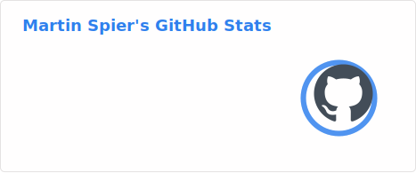

# Martin Spier 👋

Engineering Leader | **AI and Cloud Infrastructure**, **Platform Engineering**, **Performance and Reliability**

I lead engineering organizations centered on making complex systems faster, more reliable, and easier for engineers to build on.

- 💼 ChatGPT Performance @ OpenAI
- 🧠 Interests: AI, platform engineering, performance engineering, distributed systems, observability, DX
- 📫 Contact: hello@martinspier.io
- 🔗 LinkedIn: https://linkedin.com/in/martinspier
- 📄 Resume: https://github.com/spiermar/resume.md
- 🌐 Site: https://martinspier.io

## Badges

## Now

- Scaling **engineering organizations** focused on complex engineering problems
- Engineering leadership that drives **business impact and delivery velocity**
- Making systems faster and more reliable through **performance and reliability** engineering
- Building **AI & cloud infrastructure** platforms that help teams ship faster with higher reliability
- Creating general purpose **AI agents and skills** for productivity and development workflows
- Staying hands-on with **profiling, flame graphs, and performance tooling**

## Featured projects

- 🔥 **FlameScope** — visualize flame graphs across time ranges  
  https://github.com/Netflix/flamescope

- 📈 **d3-flame-graph** — flame graph visualization library (D3)  
  https://github.com/spiermar/d3-flame-graph

- 🌡️ **d3-heatmap2** — heatmap visualization library  
  https://github.com/spiermar/d3-heatmap2

- 📦 **opencode-container** — containerized development environment  
  https://github.com/spiermar/opencode-container

## Areas I care about

- **AI & Agents**: agent-driven development, local LLMs, autonomous workflows, skill engineering
- **Platform Engineering**: abstraction layers, golden paths, service ownership, operational readiness
- **Developer Experience**: reducing friction, internal platforms, paved roads, measurable productivity
- **Reliability**: SLOs, observability, incident learning loops, safe delivery
- **Performance**: profiling, flame graphs, tracing, workload-aware optimization
- **Efficiency**: cost visibility, unit economics, vendor strategy, practical FinOps

---

## GitHub stats

   
  

<small>Last updated: Feb 2026</small>
